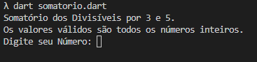
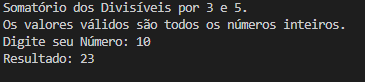
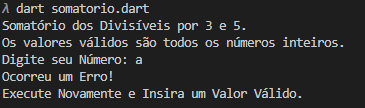

# Somatório dos Divisíveis por 3 ou 5.

![dart][dart-shield]

###### Este projeto é um simples função que aceita um valor inteiro e retorna o somatório dos valores anteriores, todos aqueles que são divisíveis por 3 e 5. Em exemplo, se o valor 10 for inserido, será retornado o somatório de 9, 6, 5 e 3, sendo eles divisíveis por 3 ou 5, retornando assim 23 como valor da soma.


## Preparando

###### Para executar esse app é necessário alguns recursos:

* Uma IDE de sua escolha (eu utilizei o Visual Studio Code, mas poderia ser qualquer outro, a exemplos como Atom ou Sublime Text. Link do VSC: https://code.visualstudio.com/Download).
* SDK do Dart (Eu baixei pelo site do Flutter, mas caso não queira o Flutter instalado na sua máquina, pode baixar o Dart apenas pelo próprio site, é só seguir as instruções. Link: https://dart.dev/get-dart)


## Rodando E Testando

###### Algums coisas serão necessárias para testar o app:

* Abra o projeto com sua IDE e acessando o terminal ou diretamente pelo terminal, acessando o caminho do projeto. Execute então o camando:

````
> dart somatorio.dart
````

* Após executar este comando, o dart irá rodar o .dart que contém a aplicação com a função somatório, e assim irá aparecer a tela inicial, pedindo para que você insira um valor inteiro pelo terminal:


* Após inserir um valor inteiro pelo terminal, ele irá somar todos os valores anteriores a ele, e depois retornará o resultado. Segue um exemplo após a execução do valor 10:


* Após a saída do resultado, a execução da aplicação é parada, e será necessário executar de novo o comando inicial para fazer uma nova operação.

* Caso seja inserido um valor diferente de inteiro, o app irá acusar erro e a execução será finalizada. Exemplo colocando a letra 'a':


## Contato

[![Gmail][gmail-shield]][gmail-url]
[![LinkedIn][linkedin-shield]][linkedin-url]
[![Github][github-shield]][github-url]

<!-- PROJECTS SHIELDS  -->
[dart-shield]: https://img.shields.io/badge/-Dart-grey.svg?logo=dart&colorB=white&logoColor=blue

<!-- CONTACT SHIELDS -->
[linkedin-shield]: https://img.shields.io/badge/-LinkedIn-white.svg?logo=linkedin&colorB=0077B5&logoColor=white
[linkedin-url]: https://linkedin.com/in/alexandre-de-araujo-verissimo-mota-278a82101/
[gmail-shield]: https://img.shields.io/badge/-Gmail-black.svg?logo=gmail&colorB=D14836&logoColor=white
[gmail-url]: mailto:alaksanduverissimo@gmail.com?subject=It%20comes%20from%20Github%20profile
[github-shield]: https://img.shields.io/badge/-Github-black.svg?logo=github&colorB=181717&logoColor=white
[github-url]: https://github.com/Alaksandu

